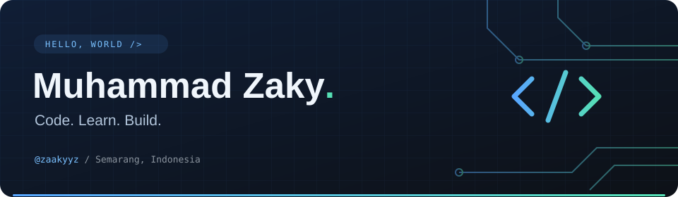
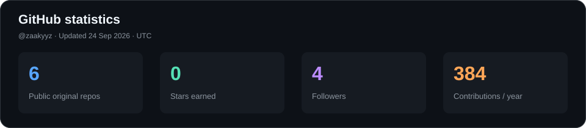
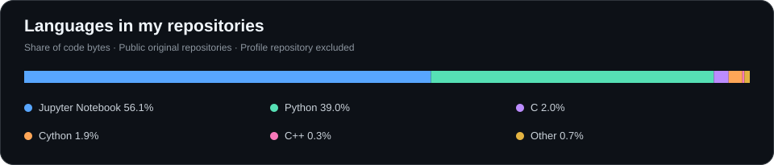
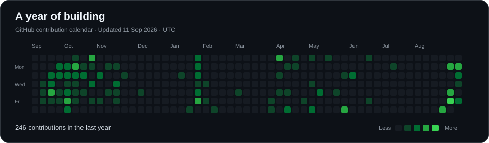

  

<h1 align="center">Hi there, I'm Zaky 👋</h1>

  <b>Exploring software, one project at a time.</b> 
  Politeknik Negeri Semarang · Semarang, Indonesia

  
  

## 👨‍💻 About me

I'm **Muhammad Zaky**, based in **Semarang, Indonesia**.

- 🏫 Affiliated with **Politeknik Negeri Semarang**.
- 🔍 Exploring **Python, image processing, and computer vision** through hands-on projects.
- 🛠️ My repositories include experiments with **web, mobile, and hardware-related code**.
- 🌱 Learning by building, debugging, and improving along the way.

## 🧰 Technologies I explore

  

## 🚀 Project spotlight

| Project | What you'll find |
| :--- | :--- |
| [**QR Code & Barcode Detector**](https://github.com/zaakyyz/QRCode-Barcode-Detector) | Real-time webcam detection and code validation with Python, OpenCV, and pyzbar. |
| [**Pengolahan Citra**](https://github.com/zaakyyz/Pengolahan-Citra) | Image-processing experiments in Jupyter notebooks. |
| [**goodtrap**](https://github.com/zaakyyz/goodtrap) | A Python project from my learning journey. |

<a href="https://github.com/zaakyyz?tab=repositories">See all public repositories →</a>

## 📊 GitHub at a glance

  

  

  

Updated daily with GitHub Actions. Repository and language statistics use public, non-fork repositories (excluding this profile). Language share measures code size, not proficiency. Contributions follow GitHub's visible contribution calendar.

---

<b>Thanks for stopping by!</b> Code. Learn. Build. Repeat.

